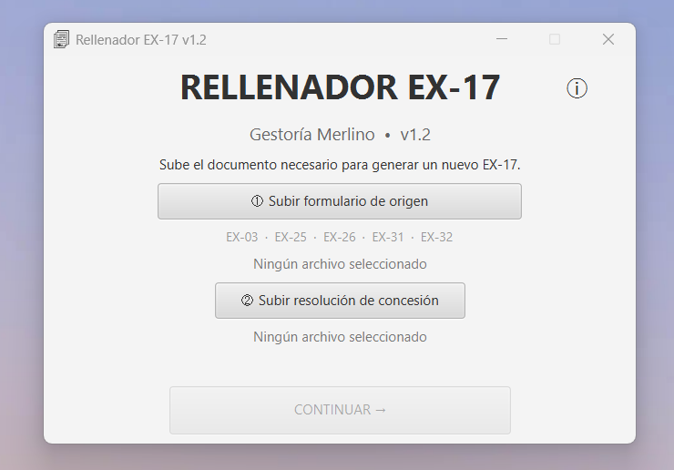

# Rellenador EX-17

  

## Vista de la aplicación

  

Aplicación de escritorio desarrollada para facilitar y automatizar el
rellenado del formulario oficial EX-17 a partir de otros formularios de
extranjería y de una resolución de concesión.

## Versión

**v1.2.0**

## Formularios compatibles

Actualmente la aplicación permite utilizar como documento de origen:

- EX-03
- EX-25
- EX-26
- EX-31
- EX-32

Los datos detectados se trasladan automáticamente a una plantilla limpia
del formulario EX-17.

## Funcionalidades

- Detección automática del tipo de formulario de origen.
- Extracción automática de los datos personales.
- Carga de una resolución de concesión.
- Extracción automática del NIE desde la resolución.
- Validación del NIE.
- Generación automática de un nuevo formulario EX-17.
- Rellenado de datos personales, domicilio y datos de contacto.
- Rellenado de sexo y estado civil cuando están disponibles en el documento de origen.
- Rellenado automático del domicilio a efectos de notificaciones.
- Rellenado automático del lugar y fecha de firma.
- Marcado automático de las opciones predeterminadas del formulario.
- Selección de la carpeta de destino.
- Nombre automático para los documentos generados.
- Carga de documentos mediante selector de archivos o arrastrar y soltar.
- Memorización de la última carpeta utilizada.
- Sistema de registro de errores.
- Acceso a los detalles del último error desde la aplicación.

## Funcionamiento

1. Seleccionar o arrastrar el formulario de origen compatible.
2. Seleccionar o arrastrar la resolución de concesión.
3. La aplicación extrae y valida automáticamente el NIE.
4. Pulsar **Continuar**.
5. Elegir la ubicación donde se guardará el nuevo documento.
6. La aplicación genera automáticamente el EX-17 cumplimentado.

Se recomienda revisar siempre el PDF generado antes de utilizarlo.

## Tecnologías utilizadas

- Java 21
- JavaFX
- Apache PDFBox 3
- Maven

## Requisitos

La versión instalable para Windows incluye el entorno necesario para
ejecutar la aplicación.

No es necesario instalar Java por separado.

## Registros de errores

La aplicación dispone de un sistema de registros para facilitar el
diagnóstico de posibles errores durante la generación de documentos.

En Windows, los registros se almacenan en:

`%LOCALAPPDATA%\Rellenador EX-17\logs\`

También pueden abrirse desde la opción **Acerca de → Abrir registros**.

## Autor

**Edinson Marvin Egoavil Samaniego**

Gestoría Merlino

Correo: marvinegoavilz@gmail.com  
Teléfono: 722 516 228

## Aviso

Esta aplicación es una herramienta de apoyo para la cumplimentación de
documentación administrativa.

La información extraída y los documentos generados deben ser revisados
antes de su presentación o utilización.

La aplicación no sustituye la comprobación profesional de la documentación.